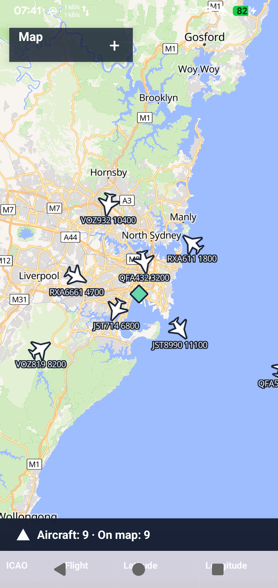
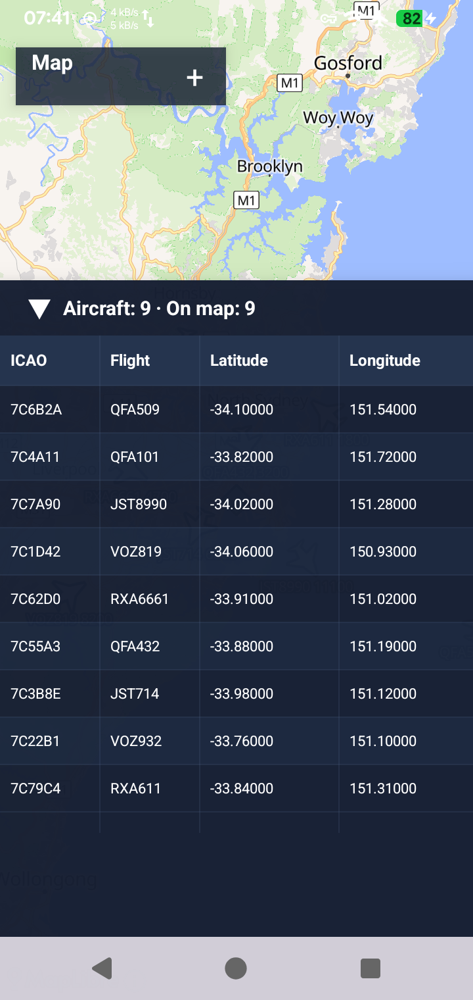
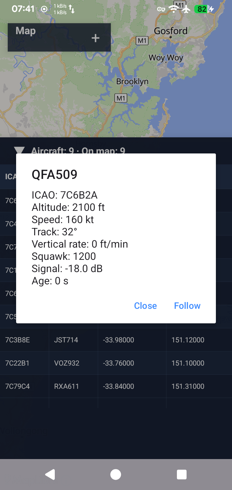

# SkyPulse

SkyPulse decodes 1090 MHz Mode S/ADS-B aircraft traffic on Android using an RTL-SDR.

## See SkyPulse in action

  
  
  

## What it does

- Shows decoded aircraft on a live map, including callsign, altitude, speed, heading, and squawk when transmitted.
- Keeps FIR and TRACON boundary snapshots available even when the receiver has no network connection.
- Can share raw aircraft frames with compatible local apps through optional Beast TCP output.
- Supports a configurable start-at-boot mode for unattended receiving.

## What you need

- An Android phone or tablet with USB OTG support.
- A compatible RTL-SDR dongle and antenna.
- The separate `marto.rtl_tcp_andro` driver app, available from F-Droid.

## Get started

1. Install SkyPulse and the RTL-TCP driver.
2. Connect the RTL-SDR through USB OTG, then open SkyPulse.
3. In **Settings**, enter your receiver latitude and longitude. (Optional)
4. Tap **Start**, then open the map to see received aircraft.

## Map and boundary data

The map uses OpenFreeMap when opened. FIR and TRACON data is bundled for offline use. Automatic boundary updates are off by default; enable them or request a manual update in Settings.

## Beast TCP export

The Beast frame pipeline is part of normal decoding. Beast TCP export is disabled by default. Enable it in **Settings → Data export → Beast TCP export** for local clients such as Termux/readsb. It listens only on `127.0.0.1`, using port `30005` by default.

## Unattended operation

Use **Settings → Start at boot** to allow boot startup. It is user-configurable; Android and ROM background restrictions can affect automatic startup.

## Privacy and network access

See [PRIVACY.md](PRIVACY.md). SkyPulse has no analytics, ads, accounts, or Google Play Services.

## License and attribution

SkyPulse is GPL-3.0-or-later. Decoder, map, and boundary-data attribution is in [NOTICE.md](NOTICE.md).

## Contributing

See [CONTRIBUTING.md](CONTRIBUTING.md).
